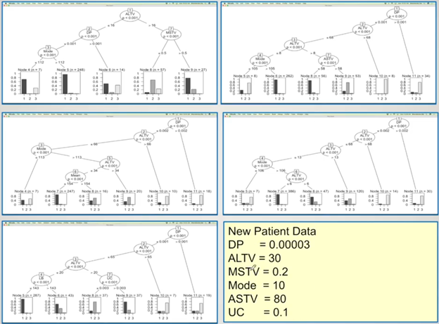
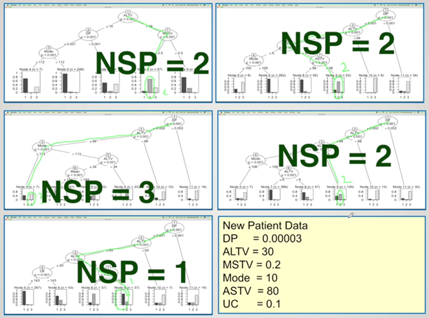

\newpage
\tableofcontents
```{r setup, include=FALSE}
knitr::opts_chunk$set(echo = TRUE, warning=FALSE,comment = NA, message=FALSE,
                      fig.height=4, fig.width=6)
```

\newpage
### Load the Following Libraries
```{r}
library(sjmisc)
library(sjPlot)
library(nnet)
library(wakefield)
library(dplyr)
library(nnet)
library(caTools)
library(ROCR)
library(stargazer)
library(dplyr)
library(nnet)
library(caTools)
library(ROCR)
library(stargazer)
library(ISLR)
library(ISLR2)
library(MASS)
library(caret)
library(splines)
library(splines2)
library(pROC)
library(ISLR)
library(ISLR2)
library(MASS)
library(caret)
library(splines)
library(splines2)
library(pROC)
library(randomForest)
library(rpart)
library(rpart.plot)
library(rattle)
library(ISLR2)
library(MASS)
library(caret)
library(splines)
library(pROC)
library(rattle)
library(rpart)
library(party)
library(partykit)
library(ggplot2)
```


# APPLICATION OF RANDOM FOREST IN CLASSIFICATION MODEL
## Load the data set
```{r}
mydata4 <- read.csv("Cardiotocographic.csv", header = TRUE)
str(mydata4)
attach(mydata4)
```

The data loaded has 2126 observations with 22 variables. This data is called is CTG. The data has the variable FHR, fetal heart rate and uterine contraction (UC) feature on cardiotocograms. 2126 fetal cardiotocograms (CTGs) automatically processed and diagnostic feature measured. CTG classified by three experts obstetrician and consensus classification label as Normal, Suspect or Pathologic. The response variable is NSP (Normal, Suspect, Pathologic) and all the 21 variables are predictor variables. Remember NSP is an integer, we will have to convert it factor

```{r}
mydata4$NSP <- factor(mydata4$NSP, levels = c(1,2,3),
                      labels = c("Normal", "Suspect", "Pathologic"))
str(mydata4)
```

LB - FHR baseline (beats per minute)
AC - # of accelerations per second
FM - # of fetal movements per second
UC - # of uterine contractions per second
DL - # of light decelerations per second
DS - # of severe decelerations per second
DP - # of prolongued decelerations per second
ASTV - percentage of time with abnormal short term variability
MSTV - mean value of short term variability
ALTV - percentage of time with abnormal long term variability
MLTV - mean value of long term variability
Width - width of FHR histogram
Min - minimum of FHR histogram
Max - Maximum of FHR histogram
Nmax - # of histogram peaks
Nzeros - # of histogram zeros
Mode - histogram mode
Mean - histogram mean
Median - histogram median
Variance - histogram variance
Tendency - histogram tendency
NSP - fetal state class code (N=normal; S=suspect; P=pathologic)

```{r}
head(mydata4,5)
```

Now let us look at how many observations are present for each factor (Normal, Suspect, Pathologic)
```{r}
frq(mydata4, NSP)
```

From the frequency table above, majority of the respondents were found in normal category (1655), followed by those in suspect category (195) and finally those in pathologic category (176)

### Data Partitioning
We shall start with random seed so that we can make this analysis reproducible
```{r}
set.seed(123)
ind <- sample(2, nrow(mydata4), replace = TRUE, prob = c(0.7, 0.3))
train_data <- mydata4[ind ==1,] ## 1495 observations
test_data <- mydata4[ind ==2,] ## 631 observations
```

```{r}
frq(train_data, NSP)
frq(test_data, NSP)
```

### Random Forest Model
* Random Forest developed by aggregating trees
* Can be used for classification or regression 
* Avoids overfitting
* Can deal with large number of features
* Helps with feature selection based on importance
* Use-friendly: only 2 free parameters
Trees - ntree, default 500 
Variables randomly sampled as candidates at each split-mtry, default is sq.root(p) for classification & p/3 for regression

Random forest methodology is developed by aggregating several decision trees. Instead of using one decision tree, random forest uses several or hundreds of decision trees and aggregate the results from all the trees to come up with classification model. Remember, random forest can be used classification as well as regression. If the response variable is categorical variable, the algorithm will develop a classification model, and if the response variable is continuous, the algorithm will develop a regression model. 

## Steps
### 1. Draw ntree bootstrap samples
### 2. For each bootstrap sample, grow un-prunned tree by choosing best based on a random sample of mtry predictors at each node
### 3. Predict new data using the majority votes for classificatio and average for regression based on ntree trees

Consider an example below
```{r}

```

```{r}

```


According to the information given, the algorithm predicted that the patient belongs to suspect category. We are going to make use of random fores; however, let consider case of sample case of decision tree

### Sample Decision Tree
```{r fig.height=9, fig.width=12}
DT <- rpart(NSP ~ ., data=train_data, method="class")
fancyRpartPlot(DT)
```

### Prediction with Decision Tree
```{r}
mypred <- predict(DT, newdata = train_data, type = "class")
head(mypred, 5)
head(train_data$NSP,5)
```

```{r}
confusionMatrix(mypred, train_data$NSP)
```

### Make Prediction using the Test data
### Prediction with Decision Tree
```{r}
mypred <- predict(DT, newdata = test_data, type = "class")
head(mypred, 5)
```


### From the testing data
```{r}
head(test_data, 5)
```

```{r}
confusionMatrix(mypred, test_data$NSP)
```

### DEVELOPE A RANDOM FOREST MODEL.
```{r}
library(randomForest)
set.seed(222)
```

We will therefore estimate our classification model with NSP as our dependent variable and all the remaining variable as independent variables
```{r}
rf <- randomForest(NSP~.,data = train_data)
```

Let us now look at the model using print function
```{r}
print(rf)
```

The output is accompanied by the formular used, where we use NSP as DV, and all the other as IV. The data used in this algorithm is from the training data. This random forest is classification because the response variable is categorical/factor. The default number of trees is 500. The mtry, is the number of variable tried at each split is 4. Out of Bag estimate of error rate is approximately 5.75%. So we have about 94.25% accuracy, which is quite okay. The error when predicting Normal people is very low as compared to when predicting suspect or pathologic.

So what attributes does this model has, we can check using the command below;
```{r}
attributes(rf)
```

The model contains all the attributes listed above, for example, if we need the confusion matrix only, we can use the command below
```{r}
rf$confusion
```

### Prediction and Confusion Matrix
We will make prediction using the package caret
```{r}
library(caret)
```

We can view the prediction from the model vs the real data
```{r}
p1 <- predict(rf, train_data)
head(p1)
```

Observations from the real data
```{r}
head(train_data,6)
```

The first six prediction are all accurate, that is 100% accuracy for the six observations
```{r}
confusionMatrix(p1, train_data$NSP)
```

From the confusion matrix, the model predicted that 1160 people belong in grouped and were alos observed to belong in group 1. The model predicted that 211 people belong in group 2 and the were observed to belong to group 2 and lastly the model predicted that 122 people belong in groups and indeed were observed to belong in group 3. However, we two people we misclassified to belong to group while they were observed to belong in group 2

Sensitity statistics tell us how often classes were correctly classified. In other words, sensitity for class 1 is 1.00, that is, we have 100 accuracy that patient in class 1 were correctly classified to belong in class 1. 

### Out of Baf Error
For each bootstrap iteration and related tree prediction error using data not in bootstrap sample (also called out of bag of OOB data) is estimated
* Classification: Accuracy
* Regression: R-Sq & SMSE

#### Predicting with Test Data
Now that all the data points in the train data set are seen by the model, we can try predicting using the test data which is not seen by the model. 
We can view the prediction from the model vs the real data
```{r}
p2 <- predict(rf, test_data)
head(p2)
```
Observations from the real data
```{r}
head(test_data,5)
```

### Create the Confusion Matrix
```{r}
confusionMatrix(p2, test_data$NSP)
```

The test data has not been seen by the random forest model and the accuracy has come down to 93.34%. The 95% CI is still good, ranging between 91% to 95%. There is slightly higher misclassification from the test data as compared to the train data. Besides, sensitivity for preicting class 1 is still higher as compared to class 2 and 3.

# Error Rate of Random Forest Model
We will make a plot using the command below to see error rate in our model
```{r fig.width= 8, fig.height=6}
plot(rf, main ="Error Rate of the Random Forest Model")
```


As the number of trees grows, the out of bag error comes down to later remain constant. From the plot, we cannot improve the error after about 300 trees. 

# Tune the Random Forest Model
The code below is used to optimize and fine-tune parameters for a random forest model. Here's a breakdown of the function's arguments and their purposes:

*train_data[,-22]:* This represents the training data where all columns except the 22nd column are used as predictor variables (independent variables) for model training.

*train_data[,22]:* This represents the 22nd column of the training data, which is typically used as the target variable (dependent variable) that the model will aim to predict.

*stepFactor = 0.5:* stepFactor is a parameter that controls the size of steps to be taken when exploring the parameter space. In this case, it's set to 0.5, which means that the function will explore parameter values in increments of 0.5.

*plot = TRUE:* When plot is set to TRUE, it means that the function will generate plots to visualize the results of tuning.

*ntreeTry = 300:* ntreeTry specifies the number of trees to try when tuning the random forest model. In this case, it will try different numbers of trees in the range specified to optimize the model.

*trace = TRUE:* When trace is set to TRUE, it provides information on the progress of the tuning process.

*improve = 0.05:* improve sets the threshold for improvement. The tuning process will continue until an improvement in the model's performance (measured by the out-of-bag error) is less than or equal to 0.05.

The tuneRF function is used to find the optimal number of trees and other hyperparameters for a random forest model. It does this by conducting a search over different values for the number of trees and other hyperparameters, evaluating the model's performance, and then providing recommendations for the best combination of hyperparameters. The results are typically visualized in a plot to help you choose the best model configuration.


```{r}
t<- tuneRF(train_data[,-22], train_data[,22],
       stepFactor = 0.5,
       plot = TRUE,
       ntreeTry = 300,
       trace = TRUE,
       improve = 0.05)
```

The out of bag error is high when mtry =2 but comes down as mtry increases to 4 and comes further down when mtry = 8 and rises when mtry = 16. This gives us an idea of what mtry value we should choose. We can now go back to our random forest model and change a few things to tune our model
```{r}
rf2 <- randomForest(NSP~.,data = train_data,
                   ntree = 300,
                   mtry = 8,
                   importance = TRUE)
```

### Print the model
```{r}
print(rf2)
```

Earlier, the out of bag error was 5.62% and this one, the OOB has come down to 5.28%. Besides, classification for predicting class 2 and 3 groups have improved as compared to the previous model. However, the classification error for predicting class 1 worsened. Let us check the accuracy level of our model
```{r}
p_1 <- predict(rf2, train_data)
head(p_1)
head(train_data$NSP)
```

```{r}
confusionMatrix(p_1, train_data$NSP)
```

The real test to see how our model is performing will be based on the test data as shown below
```{r}
p_2 <- predict(rf2, test_data)
head(p_2)
```

```{r}
head(test_data,6)
```

```{r}
confusionMatrix(p_2, test_data$NSP)
```

No much changes in our model but there are some improvements

#### Make Prediction using the Tuned Model
```{r}
cardio1 <- read.csv("cardio.csv")
head(cardio1, 5)
attach(cardio1)
```

```{r}

cardio1$NSP <- factor(cardio1$NSP, levels = c(1,2,3),
                      labels = c("Normal", "Suspect", "Pathologic"))
head(cardio1,5)
```


### Prediction
```{r}
my_prediction <- predict(rf2, newdata = cardio1, type = 'class')
head(my_prediction,5)
```

```{r}
confusionMatrix(my_prediction, cardio1$NSP)
```

```{r}
cardio1$Prediction <- my_prediction
head(cardio1,5)
View(cardio1)
```

### Number of Nodes for Trees
Remember we have 300 trees in this model
```{r fig.height=5, fig.width=7}
hist(treesize(rf2),
     main = "Number of Nodes for the Trees",
     col = "blue")
```

The histogram shows the distribution of the number of nodes in each of those 300 trees. From the histogram above, there are about 80 trees with approximately 80 nodes in each. We also have few trees with sixty nodes and also few trees with more than 100 nodes. Majority of trees have an average of 80 nodes. 

### Variable Importance
We can also find which variable played an important role in the model using the command below
```{r fig.height=6, fig.width= 8}
varImpPlot(rf2, main = "Variable Importance in our Random Forest Model")
```

The chart shows how worst the model would perform if we remove each variable. In other words, the first chart shows the mean decrease accuracy when a variable is removed. Some variable have a higher contribution to our model as compared to other. For example, DS variable has almost zero contribution while variable such as ASTV abd ALTV have higher contribution to our model. 
The second chart measure how pure the nodes are at the end of the tree without each variable. From the chart, the first four stands out as the most significant predictors, where if we remove them from model, mean Gini decreases significantly. 

Let us view the fisrt top ten variables
```{r fig.height=5, fig.width= 8}
varImpPlot(rf2,
           sort = TRUE,
           n.var = 10,
           main = "Variable Importance in our Random Forest Model: Top 10")
```

We can as well get the quantitative value to evaluate the variable importance.

```{r}
rf2$importance
```

Let us now get which predictor variables are actually used in the random forest
```{r}
varUsed(rf2)
```

The results above shows how many time each variable occurred/was used in the model. DS was only used twice in the model.

# Partial Dependence Plot
partial dependence plot give a good graphical depiction of marginal effect of a variable on the class probability (classification) or response (regression)
```{r fig.height=6}
partialPlot(rf2, train_data, ASTV, "Normal")
```


When ASTV is less than 60, the model predicts the patient to belong in class 1 as compared to when ASTV is more than 60. Similarly we can look at the plot for class 3

```{r fig.height=6}
partialPlot(rf2, train_data, ASTV, "Pathologic")
```

From the plot, when ASTV is more than 60, the model predict class 3 more than when ASTV is less than 60. From the previous results we saw that misclassification was generally high in class two. Lets make a plot to ASTV for class 2
```{r fig.height=6}
partialPlot(rf2, train_data, ASTV, "Suspect")
```

We can see there is more confusion with class 2.

# Extracting A Single Tree
Let us get the first tree
```{r}
getTree(rf2, 1, labelVar = TRUE)
```

From the results, whenever it says, the status is -1, it means, this node is a terminal node and the classification based on this terminal node is the patient NSP value is 2 or the patient is suspect. Similarly at various terminals where status is negative the model predict patients' NSP as 3 and 1 as well. 

### Testing the Model by classifying patients with following information. 
```{r}
patients <- read.csv("patients.csv")
patients$NSP <- factor(patients$NSP, levels = c(1,2,3),
                       labels = c("Normal","Suspect","Pathologic"))
str(patients)
head(patients,5)
```

```{r}
# Use the trained random forest model to classify the patient
predicted_class <- predict(rf2, patients)
```

```{r}
# The 'predicted_class' variable now contains the predicted class (1, 2, or 3)
# You can print or use it as needed
print(predicted_class)
```

```{r}
### Actual data
head(patients$NSP)
```

### Accuracy of the Model
```{r}
confusionMatrix(predicted_class, patients$NSP)
```

```{r}
patients$Prediction <- predicted_class
head(patients,5)
```

### Prediction with another set of data
### Testing the Model by classifying patients with following information. 
```{r}
patients1 <- read.csv("cardio.csv")
patients1$NSP <- factor(patients1$NSP, levels = c(1,2,3),
                       labels = c("Normal","Suspect","Pathologic"))
str(patients1)
head(patients1,5)
```

```{r}
# Use the trained random forest model to classify the patient
predicted_NSP <- predict(rf2, patients1)
```

```{r}
# The 'predicted_class' variable now contains the predicted class (1, 2, or 3)
# You can print or use it as needed
print(predicted_NSP)
```

### View the Actual and Predicted Classes
```{r}
patients1$Predicted <- predicted_NSP
head(patients1,5)
#View(patients1)
```

### Accuracy of the Model
```{r}
confusionMatrix(predicted_NSP, patients1$NSP)
```

## Additional Machine Learning Algorithm to Predict Heart Failure
```{r}
mydata4 <- read.csv("Cardiotocographic.csv", header = TRUE)
mydata4$NSP <- as.factor(mydata4$NSP)
str(mydata4)
attach(mydata4)
```

### Make Some Plots
```{r}
par(mfrow=c(1,2))

boxplot(LB ~ NSP)
boxplot(ASTV ~ NSP)
boxplot(Width ~ NSP)
boxplot(Median ~ NSP)
```

### Correlation Matrix
```{r fig.width=10, fig.height=10}
par(mfrow=c(1,1))
pairs( cbind(AC, ASTV, ALTV, MSTV, Width, Mean, DP, UC), pch=19, lower.panel=NULL, cex=.5)

```

### Correlation Plot
```{r fig.width=10, fig.height=10}
library(corrplot)
mydata4 %>% 
  dplyr::select(LB:Tendency) %>%
  cor() %>%
  round(3) %>%
  corrplot(method = "color", addCoef.col="white", type = "lower", 
           title="Correlation Matrix: Cardiotocographic Data",
           mar=c(0,0,2,0),
           tl.cex=0.8, number.cex = 0.6)
```


```{r fig.width=10, fig.height=10}
library(GGally)
cor.data <- data.frame(ASTV, MSTV, ALTV, Mean, AC, DP, UC, Median, NSP)
ggpairs(cor.data, mapping = aes(col = NSP)) +
  theme_bw()
```

### looking at classification based on p.hat = .5 cutoff
### 10-fold CV, repeated 5 times
```{r}
train_model <- trainControl(method = "repeatedcv", number = 5, repeats=10)


model.cart <- train( NSP ~., 
  data = mydata4, 
  method = "rpart",
  trControl = train_model)

model.cart

model.cart$finalModel

confusionMatrix(predict(model.cart, mydata4), 
                reference=mydata4$NSP, positive="1")

```

```{r}
fancyRpartPlot(model.cart$finalModel)

model.rf <- train(
  NSP ~.,
  data = mydata4, 
  method = "rf",
  trControl = train_model)
model.rf
```

```{r}
summary(model.rf$finalModel)

model.rf$finalModel

plot(model.rf$finalModel)

varImp(model.rf$finalModel)
plot( varImp(model.rf) )

yhat = 1-predict(model.rf$finalModel, type="prob")[,1]
plot(mydata4$ASTV, yhat)
```


```{r}
scatter.smooth(mydata4$MSTV, yhat, span=.4) 
scatter.smooth(mydata4$ASTV, yhat, span=.4) 
scatter.smooth(mydata4$ALTV, yhat, span=.4) 
scatter.smooth(mydata4$Mean, yhat, span=.4) 
scatter.smooth(mydata4$DP, yhat, span=.4)
scatter.smooth(mydata4$Mode, yhat, span=.4)
scatter.smooth(mydata4$AC, yhat, span=.4)
scatter.smooth(mydata4$UC, yhat, span=.4)
boxplot(yhat ~ Tendency)
boxplot(yhat ~ mydata4$NSP)

confusionMatrix(predict(model.rf, mydata4), 
                reference=mydata4$NSP, positive="1")
```

