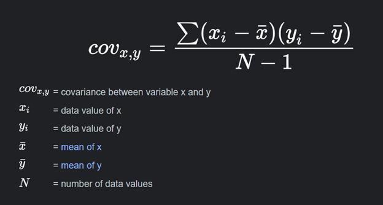
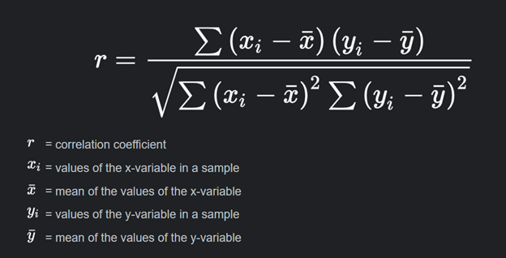

\newpage
```{r setup, include=FALSE}
knitr::opts_chunk$set(echo = TRUE, warning=FALSE,comment = NA, message=FALSE,
                      fig.height=4, fig.width=6)
```

## MATRICES
### Matrix Creation
```{r}
A = matrix(c(5,6,2,8,9,2,4,5,1),ncol = 3, nrow = 3, byrow = T)
A
```

### Getting the determinant of a matrix
```{r}
det(A)
```

### Inverse
```{r}
solve(A)
```

### Matrix Operation 
```{r}
B <- matrix(c(3,4,6,2,3,4,5,2,5), ncol = 3, nrow = 3, byrow = T)
C <- matrix(c(8,5,3,2,3,5,9,3,3), ncol = 3, nrow = 3, byrow = T)
```

### View the matrix
```{r}
B
C
```

### Matrix Addition
```{r}
B+C
```

### Matrix Subtraction
```{r}
B-C
```

### Matrix Division
```{r}
B/C
```

### Matrix Multiplication
```{r}
B*C
B%*%C
```

### Getting the Identity Matrix
```{r}
zapsmall(solve(A)%*%A)
```

### Mathematical Operations
#### Addition
```{r}
y = 45+65
y
```

#### Subtraction
```{r}
x = 563-546
x
```

### Division
```{r}
m = 563/87
m
```

### Multiplication
```{r}
t = 56*56
t
```

#### Squares and Square roots
```{r}
sqrt(81)
sqrt(225)
225^0.5
5^2
```

### Exponentials and Logarithmic
```{r}
logarithm <- log10(100)
logarithm
```

### To be checked!!!!!! (Finally checked)
```{r}
exp(logarithm) ### Not this one!!!!, it is the one below
10^logarithm
```

### Data Importation (Comma Seperated Values, csv)
```{r}
data <- read.csv("Gapminder.csv")
head(data,5)
tail(data,5)
```

### Check the structure of the data
```{r}
str(data)
```

### Manual Data Entry
```{r}
age <- c(45,65,34,32,23,25,56,76,45,22,21,45,34,56,54)
age
height <- c(122,134,144,165,155,133,123,132,145,154,166,134,121,154,165)
height
```

### Column Binding
```{r}
height_age <- cbind(age, height)
height_age
```

### Data Framing
```{r}
mydata <- data.frame(age, height)
head(mydata,5)
```


### Descriptive Statistics
```{r}
library(stargazer)
library(gtsummary)
stargazer(data[,-2], type = "text")
```

### Additional Way of Displaying Summary Statistics.
```{r}
### Load the libraries
library(ggplot2)
library(devtools)
library(predict3d)
library(psych)
library(dplyr)
library(gtsummary)
library(DescTools)
library(nortest) 
library(lmtest)
library(sandwich)
```

### Display the Summary Statistics
```{r}
knitr::kable(
  describeBy(data[,-1]) %>% round(2) 
)
```


### Frequency Distribution
```{r}
data22 <- read.csv("german_credit__data.csv")
attach(data22)
head(data22,5)
```

### How many observations do we have in our data set
```{r}
str(data22)
```

### Identify the missing observations for each variables
```{r}
library(mlr)
library(tidyverse)
map_dbl(data22, ~sum(is.na(.)))
```

### Eliminate Missing Observations
```{r}
data22<- na.omit(data22)
```

### Confirm the Remaining Observations
```{r}
str(data22)
```

### Confirm if the data set still has missing observations
```{r}
map_dbl(data22, ~sum(is.na(.)))
```

### Attach the Cleaned Data

```{r}
attach(data22)
```

### Frequency Distribution
```{r}
library(sjmisc)
frq(data22, Sex, Purpose, Housing)
```

### Create Categories For Ages
```{r}
summary(data22$Age)
```

```{r}
frq(data22, Age)
```

```{r}
data22$AgeCategory <- ifelse(Age  >=15 & Age <=25, "15-25",
              ifelse( Age >=26 & Age <= 35, "26-35",
                      ifelse(Age >= 36 & Age <= 45, "36-45",
                             ifelse(Age >= 46 & Age <= 55, "46-55",
                                    ifelse(Age >= 56 & Age <= 65, "56 -65",
                                           ifelse(Age >= 66 & Age <= 75, "66-75", NA))))))
```

### View the data with the new variable added
```{r}
data22$AgeCategory <- as.factor(data22$AgeCategory)
head(data22,5)
```

#### Frequency for the Age Distribution
```{r}
frq(data22, AgeCategory)
```
### Different to Display Frequency Table Above
```{r}
library(foreign) # for importing the Stata v12 dataset
library(dplyr)
library(tidyverse) # has drop_na() function
library(ggplot2)
library(scales) # percent function
library(kableExtra) # display table formatting
```

### Now create the Frequency Table
```{r}
(dims = dim(data22))
results = data22 %>% drop_na(AgeCategory) %>% # drop missing values by health variable
    group_by(AgeCategory) %>%  # specify categorical variable
    summarize(Frequency = n()) %>% # return counts / frequencies
    mutate(Percent = paste0(round(Frequency / dims[1] * 100, 2), "%")) # percentages
# display
kbl(results, 
    caption = "Table 2: Frequency table for Age Categories.") %>%
    kable_styling(bootstrap_options = "striped", full_width = FALSE, position = "left")
```


### Now plot a simple pie-chart.
```{r}
pie = ggplot(results, aes(x = "", y = Frequency, fill =AgeCategory)) +
    geom_bar(width = 1, stat = "identity") + # this plots a stacked bar chart
    coord_polar(theta = "y", start = 0) # convert the above bar chart to a pie chart
pie
```

### Additional Display for pi chart with Percentages
```{r fig.width=8, fig.height=6}
age_category <- prop.table(table(data22$AgeCategory))
age_category
p1<-pie(age_category, labels = paste(names(age_category), "(", round(age_category * 100, 1), "%)"), main = "Pie Chart for Age Category")

```

### The Covariance Matrix
Covariance is a statistical measure that quantifies the degree to which two random variables change together. It provides insight into the relationship between two variables.
* If Cov(X, Y) > 0, it suggests that as X increases, Y tends to increase as well (positive relationship).
* If Cov(X, Y) < 0, it suggests that as X increases, Y tends to decrease (negative relationship).
* If Cov(X, Y) = 0, it indicates that there is no linear relationship between X and Y.

However, one limitation of covariance is that it doesn't provide a standardized measure of the strength of the relationship, and it is influenced by the units of measurement. To address this, the concept of correlation is often used, which is a standardized measure of the linear relationship between two variables, making it easier to compare relationships across different datasets. Correlation is derived from covariance but has values bounded between -1 and 1, making it more interpretable and widely used for quantifying relationships between variables.
```{r}

```

```{r}
COV <- data.frame(Age, Credit.amount,Duration)
head(COV,5)
```
```{r}
cov(COV)
```


```{r}
library(stargazer)
stargazer(cov(COV), type = "text")
```

```{r}
var(COV$Age)
```

### Correlation Matrix
```{r}

```

```{r}
COR <- data.frame(Age, Credit.amount,Duration)
head(COR,5)
```

```{r}
cor(COR)
```

### Visualize the Results in Stargazer
```{r}
stargazer(cor(COR),type = "text")
```

```{r}
cor.test(COV$Age, COR$Credit.amount)
```

```{r}
cor.test(COR$Credit.amount, COR$Duration)
```

### Basic R Commands
* head
* tail
* str
* list
* attach
* Renaming data set
* View

### Example of how these commands are used
```{r}
list(data22)
```

### Data Visualization
#### Histogram
```{r}
hist(data$gdp_cap, 
     breaks = 45, 
     xlab = "gdp per capita", 
     ylab = "Frequency", 
     main = "Histogram Showing the distribution of gdp per capita")
```

### Line Chart
```{r}
### Import the data
line_plot <- read.csv("training model.csv")
attach(line_plot)
head(line_plot,5)
```

### Multiple Line plot
```{r}
library(ggplot2)
ggplot(data = line_plot, aes(x = year)) +
  geom_line(aes(y = CPI, color = "Consumer Price Index")) +
  geom_line(aes(y = Exch.Rate, color = "Exchange Rate")) +
  geom_line(aes(y = Lend.Int.Rates, color = "Lending Interest Rate")) +
  labs(x = "Time (years)", y = "Rates", color = "Lines") +
  scale_color_manual(values = c("blue", "red", "green")) +
  ggtitle("Line Plots Showing Trends in CPI, Exchange Rate and Lending Interest Rates") +
  theme_minimal()
```

```{r}
gdp_growth <- read.csv("gdp_growth.csv")
attach(gdp_growth)
head(gdp_growth,5)
tail(gdp_growth,5)
```

```{r fig.width=10, fig.height=6}
ggplot(data = gdp_growth, aes(x = year)) +
  geom_line(aes(y = GDP.growth..annual..., color = "GDP Growth (%)")) +
  labs(x = "Time (years)", y = "GDP Growth", color = "Lines") +
  scale_color_manual(values = c("blue")) +
  ggtitle("Line Plots Showing Trends GDP Growth over time") +
  theme_minimal()
```

### Alternative Good Looking Plot
```{r fig.width=10, fig.height=6}
date<-seq(as.Date("1961-01-01"),by="1 year",length.out=length(gdp_growth$year))
ggplot(data=gdp_growth,aes(x=date))+
  geom_line(aes(y=GDP.growth..annual...,colour="GDP.growth..annual..."))+
  labs(title="Trends of GDP Growth Rate over Time",
       caption="", y="GDP Rate", x="Time in Years", color="Key")+
  scale_x_date( date_labels = "%Y", breaks = "1 year")+
  theme(axis.text.x = element_text(angle = 90, vjust=0.5, size = 8))
```


### Additional Chart
```{r}
data <- read.csv("Gapminder.csv")
head(data,5)
attach(data)
```

### Leaf and Stem Plot
```{r}
stem(life_exp)
```

This kind of a chart is not appropriate for a lage data set. Consider the chart below. 
```{r}
ages <- rnorm(200, mean = 45, sd = 14)
stem(ages)
```

### A scatter plot with Regression Equation
```{r}
income <- read.csv("income.csv")
attach(income)
head(income,5)
```

```{r}
library(ggpmisc)
library(ggplot2)
ggplot(data = income, aes(x = Income, y = Consumption)) +
  stat_poly_line() +
  stat_poly_eq(eq.with.lhs = "italic(hat(y))~`=`~",
               use_label(c("eq", "R2"))) +
  ggtitle("A scatter plot of Income and Consumption") +
  geom_point()
```

### Additional Scatter Plot
```{r}
data <- read.csv("Gapminder.csv")
head(data,5)
attach(data)
```

```{r}
ggplot(data = data, aes(x = ln_gdpPercap, y = ln_life_exp)) +
  stat_poly_line() +
  stat_poly_eq(eq.with.lhs = "italic(hat(y))~`=`~",
               use_label(c("eq", "R2"))) +
  ggtitle("A scatter plot of life expectancy and gdp per capita") +
  geom_point()
```

### Box Plot
```{r}
boxplot(life_exp ~ continent, main ="Box plots of lifeExp across continents",
        xlab="Continents",ylab="lifeExp",
        col=rainbow(5))
```

### Bar Graph
#### Load the data
```{r}
BAR <- read.csv("superstore.csv")
attach(BAR)
head(BAR,5)
```

### Create Grouped Summaries
```{r}
library(tidyverse)
library(ggpubr)
library(rstatix)

SUM <- BAR %>%
  group_by(Ship_Mode) %>%
  get_summary_stats(Sales, type = "mean_sd")
SUM
```

### Create the Bar Graph
```{r}
ggplot(data = SUM, aes(x = Ship_Mode, y = mean)) +
  geom_bar(stat = "identity", fill = "steelblue") +
  labs(x = "Ship_Mode", y = "Mean") +
  ggtitle("Bar Graph of Average Sales for Various Ship Modes") +
  theme_minimal()
```

### Additional Bar Graph
```{r}
SUM2 <- BAR %>%
  group_by(Sub_Category) %>%
  get_summary_stats(Sales, type = "mean_sd")
SUM2
```

### Run the Command below to Create the bar graph of mean sales across Sub categories
```{r}
ggplot(data = SUM2, aes(x = Sub_Category, y = mean)) +
  geom_bar(stat = "identity", fill = "black") +
  labs(x = "Sub Category", y = "Mean") +
  ggtitle("Bar Graph of Average Sales for Various Sub Category") +
  theme_minimal()+
    theme(axis.text.x = element_text(angle = 90, vjust = 0.5, hjust = 1))
```

### Pie Chart
```{r}
pie(SUM$mean, labels = SUM$Ship_Mode, col = rainbow(length(SUM$mean)))
```

### Create pie chart with values and percentages
```{r}
# Calculate the percentages
percentages <- SUM$mean / sum(SUM$mean) * 100

# Create the pie chart with values and percentages
pie(SUM$mean, labels = paste(SUM$Ship_Mode, "\n", SUM$mean, " (", round(percentages, 1), "%)", sep = ""), col = rainbow(length(SUM$mean)))
```

## Testing the Normality of the Data
### Shapiro wilks statistics
```{r}
data <- read.csv("Gapminder.csv")
head(data,5)
attach(data)
```

### Perform the test
```{r}
shapiro.test(gdp_cap)
```

The Shapiro-Wilk test was performed on the variable gdp_cap. The test result shows a test statistic (W) of 0.6522 and an extremely small p-value (p-value < 2.2e-16). Since the p-value is less than 0.05 (assuming a common significance level), we reject the null hypothesis that the data follows a normal distribution. The extremely small p-value indicates strong evidence against the normality assumption for the gdp_cap dataset.

### Run the test for normally distributed data
```{r}
scores <- rnorm(200, mean = 45, sd = 14)
scores
```

```{r}
scores <- data.frame(scores)
scores
```

```{r}
## Rename the dataset
random <-scores
head(random,5)
attach(random)
```

```{r}
shapiro.test(random$scores)
```

## Make a histogram to Visualize the results
```{r}
### Make a histogram
hist(random$scores, breaks = 14, prob = TRUE, main = "Histogram of scores with Normal Curve")
curve(dnorm(x, mean = mean(random$scores), sd = sd(random$scores)), add = TRUE, col = "blue", lwd = 2)
```

### Student's Task: 
How to standardize data in R


### Parametric Test
#### One sample T-test
```{r}
t.test(scores, mu=40, alternative = "greater", conf.level = 0.90)
```

### Interpretation!!! (student's part)

### Two Samples T-test
#### Dependent t-test
```{r}
weight_before <- c(75,90,78,65,78,89,87,65,67,78,45,67,67,87,90)
weight_after <- c(73,85,70,59,72,90,81,60,64,71,39,69,73,82,83)
```

### Data frame the dataset
```{r}
paired <- data.frame(weight_before, weight_after)
head(paired,5)
```

### Perform the test
```{r}
t.test(weight_before, weight_after, alternative = "two.sided", paired = T, var.equal = T, conf.level = 0.99, data = paired)
```

### Student's part!!!

### Unpaired T-test/ Independent t-test
```{r}
library(magrittr)
library(gapminder)
attach(gapminder)
```

```{r}
df1 <- gapminder %>%
  dplyr::select(country, lifeExp, year)%>%
  filter(country == "Kenya"|
           country == "Tanzania")

head(df1,14)
tail(df1,14)
t.test(data = df1, lifeExp ~ country, alternative = "greater", conf.level = 0.99, var.equal = F)
```

```{r}
df2 <- gapminder %>%
  dplyr::select(country, gdpPercap, year)%>%
  filter(country == "Kenya"|
           country == "Tanzania")

head(df2,14)
tail(df2,14)
t.test(data = df2, gdpPercap ~ country, alternative = "greater", conf.level = 0.99, var.equal = F)
```

### One-way ANOVA

```{r}
head(gapminder,5)
```

```{r}
results <- aov(lifeExp~continent)
summary(results)

```

### Post Hoc Analysis
```{r}
library(agricolae)
TKy <- TukeyHSD(results)
TKy
```

```{r}
par(oma=c(0,5,0,0)) # adjust the margins because the factor names are long
plot(TukeyHSD(results, conf.level = 0.99),las=1, col = "blue")
```

### Two-way ANOVA
```{r}
ANOVA <- read.csv("yields.csv")
attach(ANOVA)
head(ANOVA,5)
```

### Create Factors and Levels
```{r}
ANOVA$Fertilizer.Used<-factor(ANOVA$Fertilizer.Used, levels = c(1,2,3,4),
                              labels = c("DAP", "CAN", "AMONNIA","PHOSPHATE"))
ANOVA$Blocks <- factor(ANOVA$Blocks, levels = c(1,2,3,4),
                       labels = c("Block1", "Block2","Block3","Block4"))
```

### View the dataset
```{r}
head(ANOVA,5)
```

### Get the grouped summary Statistics for Yields across fertilizer used
```{r}
grouped_summaries <- ANOVA %>%
  group_by(Fertilizer.Used) %>%
  get_summary_stats(Yields, type = "mean_sd")
grouped_summaries
```

### Box plot of Yields for Various Fertilizer Used
```{r}
ggplot(ANOVA, aes(x = Fertilizer.Used, y = Yields, fill = Fertilizer.Used)) +
  labs(title = "Box plot of Yields for various Fertilizer Used", y = "Yields", x = "Fertilizer")+
  geom_boxplot()
```


### Get the summary statistics for Yields across blocks
```{r}
grouped_summaries2 <- ANOVA %>%
  group_by(Blocks) %>%
  get_summary_stats(Yields, type = "mean_sd")
grouped_summaries2
```

### Box plot of Yields for Various Blocks
```{r}
ggplot(ANOVA, aes(x = Blocks, y = Yields, fill = Blocks)) +
  labs(title = "Box plot of Yields for various Blocks", y = "Yields", x = "Blocks")+
  geom_boxplot()
```


```{r}
library(ggplot2)
df <- ANOVA
str(df)
```


```{r}
#+++++++++++++++++++++++++
# Function to calculate the mean and the standard deviation
  # for each group
#+++++++++++++++++++++++++
# data : a data frame
# varname : the name of a column containing the variable
  #to be summariezed
# groupnames : vector of column names to be used as
  # grouping variables
data_summary <- function(data, varname, groupnames){
  require(plyr)
  summary_func <- function(x, col){
    c(mean = mean(x[[col]], na.rm=TRUE),
      sd = sd(x[[col]], na.rm=TRUE))
  }
  data_sum<-ddply(data, groupnames, .fun=summary_func,
                  varname)
  data_sum <- rename(data_sum, c("mean" = varname))
 return(data_sum)
}
```


```{r}
df2 <- data_summary(ANOVA, varname="Yields", 
                    groupnames=c("Fertilizer.Used", "Blocks"))
head(df2)
```

### Plot the Error Bar for Yields Against the Fertilizer Used
```{r}
library(ggplot2)
# Default bar plot
p<- ggplot(df2, aes(x=Fertilizer.Used, y=Yields, fill=Fertilizer.Used)) + 
  geom_bar(stat="identity", color="black", 
           position=position_dodge()) +
  geom_errorbar(aes(ymin=Yields-sd, ymax=Yields+sd), width=.2,
                 position=position_dodge(.9)) 
print(p)
```

### Yield Agaisnt Fertilizer Used in Every Block
```{r}
library(ggplot2)
# Default bar plot
p<- ggplot(df2, aes(x=Fertilizer.Used, y=Yields, fill = Blocks)) + 
  geom_bar(stat="identity", color="black", 
           position=position_dodge()) +
  geom_errorbar(aes(ymin=Yields-sd, ymax=Yields+sd), width=.2,
                 position=position_dodge(.9)) 
print(p)
```

### Plot the Bar Graph with Error Bars Against Blocks
```{r}
library(ggplot2)
# Default bar plot
p2<- ggplot(df2, aes(x=Blocks, y=Yields, fill=Blocks)) + 
  geom_bar(stat="identity", color="black", 
           position=position_dodge()) +
  geom_errorbar(aes(ymin=Yields-sd, ymax=Yields+sd), width=.2,
                 position=position_dodge(.9)) 
print(p2)
```

### Estimate the linear Model and Extract the ANOVA Results
```{r}
linear_model <- lm(Yields ~ Fertilizer.Used+Blocks, data = ANOVA)
my_model <- anova(linear_model)
my_model
```

### Factorial Experiment
```{r}
linear_model <- lm(Yields ~ Fertilizer.Used*Blocks, data = ANOVA)
my_model <- anova(linear_model)
my_model
```

## NON_PARAMETRIC TESTS
### Wilcoxon Signed-Rank Test:
The Wilcoxon signed-rank test is used to compare paired or related samples. It assesses whether there is a significant difference between the measurements or observations taken from the same subjects or units under two different conditions or time points. The test is appropriate for data that are not normally distributed or when the assumption of normality is violated.
#### Create the dataset
```{r}
before <- c(87,98,77,89,90,100,110,89,77,68,65,67,87,98,67,87)
after <- c(80,90,68,77,81,95,102,77,69,60,59,60,79,88,63,80)
```

### Data Frame the data
```{r}
weight_frame <- data.frame(before,after)
head(weight_frame,5)
```

### Group the Data
```{r}
library(dplyr)
library(tidyverse)
library(ggpubr)
library(rstatix)
weight_frame <- weight_frame %>%
  gather(key = "time", value = "weight", before, after) %>%
  convert_as_factor(time)
head(weight_frame, 5)
```

```{r}
View(weight_frame)
```

### Perform the test
```{r}
result <- wilcox.test(weight~time, paired = TRUE, data = weight_frame)
result
```


```{r}
weight_frame%>%
  group_by(time) %>%
  get_summary_stats(weight, type = "mean_sd")
```

### Mann-Whitney U-Test
The Mann-Whitney U test (also called the Wilcoxon rank-sum test) compares two independent groups or conditions to determine if there is a significant difference between their distributions or medians. This test is appropriate when comparing two groups without assuming normality or when the data are ordinal or skewed.

### The data
```{r}
head(gapminder,5)
```

```{r}
df1 <- gapminder %>%
  dplyr::select(country, lifeExp)%>%
  filter(country == "Kenya"|
           country == "Tanzania")

head(df1,14)
tail(df1,14)
```


### Perform the Test
```{r}
result1 <- wilcox.test(lifeExp~country, paired = FALSE, data = df1)
result1
```

```{r}
sum <- df1%>%
  group_by(country) %>%
  get_summary_stats(lifeExp, type = "mean_sd")
sum
```

```{r}
library(dplyr)
sum2<- group_by(df1, country) %>%
  summarise(
    count = n(),
    mean = mean(lifeExp, na.rm = TRUE),
    sd = sd(lifeExp, na.rm = TRUE),
    median = median(lifeExp, na.rm = TRUE),
    max = max(lifeExp, na.rm = TRUE),
    min = min(lifeExp, na.rm = TRUE),
    IQR = IQR(lifeExp, na.rm = TRUE)
  )
sum2
```

```{r}
library(kableExtra)
kable(sum2)
```

### Kruskall Wallis
The Kruskal-Wallis test is a nonparametric test used to compare the medians of three or more independent groups. It is an extension of the Mann-Whitney U test (Wilcoxon rank-sum test) for two groups. The Kruskal-Wallis test does not assume that the data are normally distributed and can handle ordinal or non-normally distributed data.

### The data
```{r}
library(magrittr)
df23 <- gapminder %>%
  dplyr::select(country, lifeExp)%>%
  filter(country == "Kenya"|
           country == "Morocco"|
           country == "United States"|
           country == "Afghanistan"|
           country == "Canada")

head(df23,5)
```

```{r}
View(df23)
```

### Grouped Summary Statistics
```{r}
library(dplyr)
group_by(df23, country) %>%
  summarise(
    count = n(),
    mean = mean(lifeExp, na.rm = TRUE),
    sd = sd(lifeExp, na.rm = TRUE),
    median = median(lifeExp, na.rm = TRUE),
    max = max(lifeExp, na.rm = TRUE),
    min = min(lifeExp, na.rm = TRUE),
    IQR = IQR(lifeExp, na.rm = TRUE)
  )
```

### Use Box Plot to Visualize the Data
```{r}
library("ggpubr")
ggboxplot(df23, x = "country", y = "lifeExp",
          color = "country", palette = c("#00AFBB", "#E7B800", "#FC4E07","#000000","#00FF00"),
          order = c("Afghanistan", "Canada", "Kenya","Morocco","United States"),
          ylab = "Life Expectancy", xlab = "Countries")
```


### Compute Kruskal-Wallis test
We want to see if the median life expectancy in five continents vary significantly. The test can be run using the kruskal.test() function as follows.

### The data
```{r}
head(df23,5)
```

### Conduct the Test
```{r}
kruskal.test(lifeExp ~ country, data = df23)
```

### LINEAR REGRESSION ANALYSIS
Statistical techniques are tools that enable us to answer questions about possible patterns in empirical data. It is not surprising, then, to learn that many important techniques of statistical analysis were developed by scientists who were interested in answering very specific empirical questions. So it was with regression analysis. The history of this particular statistical technique can be traced back to late nineteenth-century England and the pursuits of a gentleman scientist, Francis Galton. Galton was born into a wealthy family that produced more than its share of geniuses; he and Charles Darwin, the famous biologist, were first cousins. During his lifetime, Galton studied everything from fingerprint classification to meteorology, but he gained widespread recognition primarily for his work on inheritance. His most important insight came to him while he was studying the inheritance of one of the most obvious of all human characteristics: height. In order to understand how the characteristic of height was passed from one generation to the next, Galton collected data on the heights of individuals and the heights of their parents. After constructing frequency tables that classified these individuals both by their height and by the average height of their parents, Galton came to the unremarkable conclusion that tall people usually had tall parents and short people usually had short parents.

### Assumption of Regression Analysis

*1. Zero conditional mean: The error term has a population mean of zero*
*2. Endogeniety: All independent variables are uncorrelated with the error term*
*3. Autocorrelation: Observations of the error term are uncorrelated with each other*
*4. Homoscedasticity: The error term has a constant variance*
*5. Multicollinearity: No independent variable is a perfect linear function of other explanatory variables*
*6. Normality of the error terms: The error term is normally distributed (optional)*

### Load the data
```{r}
mydatta <- read.csv("Unemployment.csv")
attach(mydatta)
head(mydatta,5)
```

### To be continued!!!!
### Estimate the Model
```{r}
l.model <- lm(log(Inflation)~log(Unemployment)+log(FedRate), data = mydatta)
```

### Visualize the Model Using Stargazer Library
```{r}
library(stargazer)
stargazer(l.model, type = "text")
```

### Model Interpretation
The model above presents the results of a regression analysis with the dependent variable "log(Inflation)" and three independent variables: "log(Unemployment)", "log(FedRate)", and the constant term.
The coefficients estimated for each independent variable represent the relationship between that variable and the dependent variable while holding other variables constant. The coefficients are accompanied by standard errors in parentheses.

*log(Unemployment):* 
The coefficient estimate for log(Unemployment) is 0.176. This means that a one-unit increase in the natural logarithm of unemployment is associated with a 0.176 unit increase in the natural logarithm of inflation. The standard error of 0.157 indicates the uncertainty in this estimate.

*log(FedRate):*
The coefficient estimate for log(FedRate) is 0.976. This suggests that a one-unit increase in the natural logarithm of the Federal Reserve interest rate is associated with a 0.976 unit increase in the natural logarithm of inflation. The standard error of 0.085 provides an indication of the precision of this estimate.

*Constant:*
The constant term in the model is -0.902. This represents the expected value of the natural logarithm of inflation when all independent variables are zero. The standard error of 0.291 reflects the uncertainty in this estimation.

The observations in the dataset used for the analysis are 164. The R-squared value of 0.473 indicates that approximately 47.3% of the variance in the natural logarithm of inflation can be explained by the independent variables included in the model. The adjusted R-squared value of 0.466 on the other hand accounts for the degrees of freedom in the model and provides a more conservative estimate of the proportion of variance explained.

The residual standard error of 0.498 indicates the average deviation of the observed values of the dependent variable from the predicted values, taking into account the degrees of freedom in the model.

The F-statistic of 72.167, with 2 and 161 degrees of freedom, suggests that the overall model is statistically significant. The associated p-value is less than 0.01, indicating strong evidence against the null hypothesis of no relationship between the independent variables and the dependent variable.

In summary, the model suggests that only log(Unemployment) has a statistically significant relationship with log(Inflation). However, it is important to note that these interpretations are based on the given coefficients, standard errors, and significance levels. Further analysis and consideration of the model's assumptions are necessary for a comprehensive understanding of the relationships between the variables.


### Forecasted Inflation
```{r}
newdatta <- data.frame(log(Unemployment), log(FedRate))
head(newdatta,5)
```

```{r}
Inflation_Forecast <- predict(l.model, newdata = newdatta)
mydatta$Predicted.Inflation <- Inflation_Forecast
head(mydatta,5)
```

### Plot the Predicted Vs Actual Inflation Rate
```{r}
library(ggplot2)
ggplot(data = mydatta, aes(x = year)) +
  geom_line(aes(y = log(Inflation), color = "Inflation")) +
  geom_line(aes(y = Predicted.Inflation, color = "Predicted.Inflation")) +
  labs(x = "Time (years)", y = "Rates", color = "Lines") +
  scale_color_manual(values = c("blue", "red", "green")) +
  ggtitle("Line Plots Showing Actual and Predicted Inflation") +
  theme_minimal()
```

## Testing the Assumptions
### Normality of the error term
```{r}
library(forecast)
checkresiduals(my_model)
```

### Zero Conditional Mean
```{r}
ReSid<-resid(my_model)
```

### Add the residual variable to the data set
```{r}
mydatta$ReSid <- ReSid
head(mydatta,5)
```

### View Summary Statistics
### Additional Way of Displaying Summary Statistics.
```{r}
### Load the libraries
library("ggplot2")
library("devtools")
library("predict3d")
library("psych")
library("dplyr")
library("gtsummary")
library("DescTools")
library("nortest") 
library("lmtest")
library("sandwich")
```

### Display the Summary Statistics
```{r}
knitr::kable(
  describeBy(mydatta[,-1]) %>% round(3) 
)
```
### The variance covariance assumption
```{r}
cov(ReSid, Unemployment)
cov(ReSid, FedRate)
```

```{r}
cor.test(mydatta$Unemployment, mydatta$ReSid)

```

```{r}
cor.test(mydatta$FedRate, mydatta$ReSid)
```

### Plot the Residuals
```{r}
ts.plot(ReSid)
abline(0,0.0000)
```

### Multicollinearity
```{r}
library(car)
library(tseries)
vif(my_model)
```

### Heteroscedasticity
```{r}
ncvTest(my_model)
```

Since the p-value is greater than the conventional significance level of 0.05, we fail to reject the null hypothesis of constant variance. This means that there is not enough evidence to conclude that the variance of the residuals varies across the range of the predictor variable(s).

### Autocorrelation
```{r}
durbinWatsonTest(my_model)
```

The Durbin-Watson (D-W) statistic is a test used to detect the presence of autocorrelation in the residuals of a regression model. It measures the degree of correlation between adjacent residuals. The D-W statistic ranges from 0 to 4, with values around 2 indicating no autocorrelation, values below 2 suggesting positive autocorrelation, and values above 2 indicating negative autocorrelation.

## Suppose the variance of the Error terms was not homoscedastic
### Estimating the Regression Model with Robust Standard errors
Robust standard errors, also known as heteroscedasticity-robust standard errors or White's standard errors, are a method to estimate the standard errors in regression analysis that account for potential heteroscedasticity (unequal variances) in the error terms.

In ordinary least squares (OLS) regression, the standard errors assume that the error terms have constant variance. However, in real-world data, it is common to encounter situations where the variability of the error terms changes across different levels of the independent variables. This violates the assumption of homoscedasticity, leading to incorrect standard error estimates, t-statistics, and p-values.

Robust standard errors address this issue by providing more accurate estimates of the standard errors that are robust to heteroscedasticity. They are calculated by estimating the variance-covariance matrix of the coefficient estimates using methods that do not assume constant variance of the errors.

There are different types of robust standard errors, including the HC1, HC2, and HC3 estimators, which differ in the specific assumptions they make about the structure of heteroscedasticity. These estimators are implemented in the sandwich package in R.

By using robust standard errors, researchers can obtain more reliable inference in regression analysis, particularly when there is evidence or suspicion of heteroscedasticity. Robust standard errors allow for valid hypothesis tests, confidence intervals, and t-statistics, even in the presence of heteroscedasticity, providing more accurate and robust statistical inference.
```{r}
library(sandwich)
library(lmtest)
robust_se <- sqrt(diag(vcovHC(my_model, type = "HC1")))
robust_se
```

### View the Model
```{r}
coeftest(my_model, vcov = vcovHC(my_model, type = "HC1"))
```

### LINEAR REGRESSION ANALYSIS
Statistical techniques are tools that enable us to answer questions about possible patterns in empirical data. It is not surprising, then, to learn that many important techniques of statistical analysis were developed by scientists who were interested in answering very specific empirical questions. So it was with regression analysis. The history of this particular statistical technique can be traced back to late nineteenth-century England and the pursuits of a gentleman scientist, Francis Galton. Galton was born into a wealthy family that produced more than its share of geniuses; he and Charles Darwin, the famous biologist, were first cousins. During his lifetime, Galton studied everything from fingerprint classification to meteorology, but he gained widespread recognition primarily for his work on inheritance. His most important insight came to him while he was studying the inheritance of one of the most obvious of all human characteristics: height. In order to understand how the characteristic of height was passed from one generation to the next, Galton collected data on the heights of individuals and the heights of their parents. After constructing frequency tables that classified these individuals both by their height and by the average height of their parents, Galton came to the unremarkable conclusion that tall people usually had tall parents and short people usually had short parents.

### Assumption of Regression Analysis
*1. The regression model is linear in the coefficients and the error term*
*2. The error term has a population mean of zero*
*3. All independent variables are uncorrelated with the error term*
*4. Observations of the error term are uncorrelated with each other*
*5. The error term has a constant variance (no heteroscedasticity)*
*6. No independent variable is a perfect linear function of other explanatory variables*
*7. The error term is normally distributed (optional)*

### Load the data
```{r}
mydatta <- read.csv("Unemployment.csv")
attach(mydatta)
head(mydatta,5)
```

### Estimate the Model
```{r}
my_model <- lm(log(Inflation)~log(Unemployment)+log(FedRate), data = mydatta)
summary(my_model)
```

### Plot the Model
```{r}
plot(my_model)
```

### Visualize the Model Using Stargazer Library
```{r}
library(stargazer)
stargazer(my_model, type = "text")
```

### Obtain AIC and BIC for you Model
```{r}
library(broom)
glance(my_model)
```

### Model Interpretation
The model above presents the results of a regression analysis with the dependent variable "log(Inflation)" and three independent variables: "log(Unemployment)", "log(FedRate)", and the constant term.
The coefficients estimated for each independent variable represent the relationship between that variable and the dependent variable while holding other variables constant. The coefficients are accompanied by standard errors in parentheses.

*log(Unemployment):* 
The coefficient estimate for log(Unemployment) is 0.176. This means that a one-unit increase in the natural logarithm of unemployment is associated with a 0.176 unit increase in the natural logarithm of inflation. The standard error of 0.157 indicates the uncertainty in this estimate.

*log(FedRate):*
The coefficient estimate for log(FedRate) is 0.976. This suggests that a one-unit increase in the natural logarithm of the Federal Reserve interest rate is associated with a 0.976 unit increase in the natural logarithm of inflation. The standard error of 0.085 provides an indication of the precision of this estimate.

*Constant:*
The constant term in the model is -0.902. This represents the expected value of the natural logarithm of inflation when all independent variables are zero. The standard error of 0.291 reflects the uncertainty in this estimation.

The observations in the dataset used for the analysis are 164. The R-squared value of 0.473 indicates that approximately 47.3% of the variance in the natural logarithm of inflation can be explained by the independent variables included in the model. The adjusted R-squared value of 0.466 on the other hand accounts for the degrees of freedom in the model and provides a more conservative estimate of the proportion of variance explained.

The residual standard error of 0.498 indicates the average deviation of the observed values of the dependent variable from the predicted values, taking into account the degrees of freedom in the model.

The F-statistic of 72.167, with 2 and 161 degrees of freedom, suggests that the overall model is statistically significant. The associated p-value is less than 0.01, indicating strong evidence against the null hypothesis of no relationship between the independent variables and the dependent variable.

In summary, the model suggests that only log(Unemployment) has a statistically significant relationship with log(Inflation). However, it is important to note that these interpretations are based on the given coefficients, standard errors, and significance levels. Further analysis and consideration of the model's assumptions are necessary for a comprehensive understanding of the relationships between the variables.

### Obtain the Root Mean Square Error
```{r}
summary_model <- summary(my_model)
```

### Extract RMSE from the summary
```{r}
rmse <- sqrt(summary_model$sigma^2)
rmse
```

### Print the summary and RMSE
```{r}
print(summary_model)
cat("Root Mean Square Error (RMSE):", rmse, "\n")
```


## Testing the Assumptions
### Normality of the error term
```{r}
library(forecast)
checkresiduals(my_model)
```

### Zero Conditional Mean
```{r}
ReSid<-resid(my_model)
```

### Add the residual variable to the data set
```{r}
mydatta$ReSid <- ReSid
head(mydatta,5)
```

### View Summary Statistics
```{r}
library(stargazer)
library(gtsummary)
stargazer(mydatta[,-1], type = "text")
```

### The variance covariance assumption
```{r}
cov(ReSid, Unemployment)
cov(ReSid, FedRate)
```

### Plot the Residuals
```{r}
ts.plot(ReSid)
abline(0,0.0000)
```

### Multicollinearity
```{r}
library(car)
library(tseries)
vif(my_model)
```

### Heteroscedasticity
```{r}
ncvTest(my_model)
```
### Autocorrelation
```{r}
durbinWatsonTest(my_model)
```

## Suppose the variance of the Error terms was not homoscedastic
### Estimating the Regression Model with Robust Standard errors
Robust standard errors, also known as heteroscedasticity-robust standard errors or White's standard errors, are a method to estimate the standard errors in regression analysis that account for potential heteroscedasticity (unequal variances) in the error terms.

In ordinary least squares (OLS) regression, the standard errors assume that the error terms have constant variance. However, in real-world data, it is common to encounter situations where the variability of the error terms changes across different levels of the independent variables. This violates the assumption of homoscedasticity, leading to incorrect standard error estimates, t-statistics, and p-values.

Robust standard errors address this issue by providing more accurate estimates of the standard errors that are robust to heteroscedasticity. They are calculated by estimating the variance-covariance matrix of the coefficient estimates using methods that do not assume constant variance of the errors.

There are different types of robust standard errors, including the HC1, HC2, and HC3 estimators, which differ in the specific assumptions they make about the structure of heteroscedasticity. These estimators are implemented in the sandwich package in R.

By using robust standard errors, researchers can obtain more reliable inference in regression analysis, particularly when there is evidence or suspicion of heteroscedasticity. Robust standard errors allow for valid hypothesis tests, confidence intervals, and t-statistics, even in the presence of heteroscedasticity, providing more accurate and robust statistical inference.
```{r}
library(sandwich)
library(lmtest)
robust_se <- sqrt(diag(vcovHC(my_model, type = "HC1")))
robust_se
```

### View the Model
```{r}
coeftest(my_model, vcov = vcovHC(my_model, type = "HC1"))
```

### OMMITTED VARIABLE BIASE
#### Estimate the first model
```{r}
fit <- lm(Inflation~Unemployment+FedRate, data = mydatta)
```

```{r}
library(rempsyc)
library(jtools)
stargazer(fit,type = "text")
```

### Run the second model
```{r}
fit2 <- lm(Inflation~FedRate, data = mydatta)
```

```{r}
stargazer(fit2,confint = TRUE, digits = 3, type = "text")
```

### Test the omitted variable bias
```{r}
library(lmtest)
waldtest(fit,fit2,test = "F")
```

The null hypothesis for this test states that the coefficient of the omitted variable is zero. Here the implication is that if we accept the null hypothesis, the variable was correctly omitted. On the other hand, the alternative hypothesis states that the coefficient of the omitted variable is not equal to zero. Therefore, rejecting the null hypothesis indicates that the variable was incorrectly omitted. From the results above, the p-value is approximately 0.6704, which indicates that we fail to reject the null hypothesis and conclude that the variable was correctly omitted. Thus, the omitted variable does not helps to explain the variation in the response variable.

```{r}
library(broom)
glance(fit)
glance(fit2)
```


### Estimate the third model
```{r}
fit3 <- lm(Inflation~Unemployment, data = mydatta)
```

```{r}
stargazer(fit3,confint = TRUE, digits = 3, type = "text")
```

### Test for the omitted variable bias
```{r}
waldtest(fit,fit3,test = "F")
```

The null hypothesis for this test states that the coefficient of the omitted variable is zero. Here the implication is that if we accept the null hypothesis, the variable was correctly omitted. On the other hand, the alternative hypothesis states that the coefficient of the omitted variable is not equal to zero. Therefore, rejecting the null hypothesis indicates that the variable was incorrectly omitted. From the results above, the p-value is approximately 0.001, which indicates that we reject the null hypothesis and conclude that the variable was incorrectly omitted. Thus, the omitted variable helps to explain the variation in the response variable.

```{r}
kable(glance(fit))
kable(glance(fit3))
```

### Root Mean Square Error
```{r}
model_sum <- summary(fit)
model_sum2 <- summary(fit2)
model_sum3 <- summary(fit3)
model_sum$sigma
model_sum2$sigma
model_sum3$sigma
```


